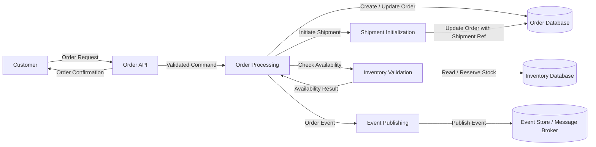

# 📊 Data Flow Diagram (DFD) – Level 1  
## Order Processing Flow

---

## 1. Purpose
This document decomposes the **Smart Logistics Platform** into internal processes
related to **Order creation and management**, showing how data flows between
actors, processes, and data stores.

---

## 2. Scope
This DFD covers:
- Order creation
- Inventory validation
- Shipment initiation
- Order persistence
- Event publication

Out of scope:
- Billing and invoicing
- Advanced reporting
- External analytics

---

## 3. External Entities

### 3.1 Customer
- Initiates order requests
- Receives order confirmations and status

### 3.2 Operations User
- Manages and updates orders
- Monitors order status

---

## 4. Processes

### P1 – Order API
- Accepts order requests
- Performs basic validation
- Sends commands for order processing

### P2 – Order Processing
- Applies business rules
- Creates or updates order aggregate
- Coordinates with inventory

### P3 – Inventory Validation
- Checks stock availability
- Reserves inventory if available
- Returns availability result

### P4 – Shipment Initialization
- Creates shipment request
- Links shipment to order
- Prepares shipment data

### P5 – Event Publishing
- Publishes order-related events
- Ensures reliable event delivery

---

## 5. Data Stores

### D1 – Order Database
- Stores order master data
- Maintains order lifecycle state

### D2 – Inventory Database
- Stores inventory levels
- Tracks reservations

### D3 – Event Store / Message Broker
- Stores or streams business events
- Enables asynchronous communication

---

## 6. Data Flows

### 6.1 Customer → P1 (Order API)
- Order request data

### 6.2 P1 → P2 (Order Processing)
- Validated order command

### 6.3 P2 → D1 (Order Database)
- Create or update order data

### 6.4 P2 → P3 (Inventory Validation)
- Inventory availability request

### 6.5 P3 → D2 (Inventory Database)
- Inventory lookup / reservation

### 6.6 P3 → P2
- Inventory availability result

### 6.7 P2 → P4 (Shipment Initialization)
- Shipment creation request

### 6.8 P4 → D1 (Order Database)
- Shipment reference update

### 6.9 P2 → P5 (Event Publishing)
- Order created / updated event

### 6.10 P5 → D3 (Event Store / Broker)
- Persisted or streamed event

### 6.11 P1 → Customer
- Order confirmation
- Order status response

## 7. DFD Level 1 – Conceptual View (Textual)

Customer
|
v
+-----------+ +-------------------+ +--------------------+
| Order | ---> | Order Processing | ---> | Order Database |
| API | +-------------------+ +--------------------+
| |
| v
| +-------------------+ +--------------------+
| | Inventory | ---> | Inventory Database |
| | Validation | +--------------------+
| |
| v
| +-------------------+
| | Shipment |
| | Initialization |
| +-------------------+
| |
| v
| +-------------------+ +--------------------+
+-----------> | Event Publishing | ---> | Event Store / |
+-------------------+ | Message Broker |
+--------------------+

### What this shows
- One **single system boundary**
- External actors only
- No internal services or databases (by design)

✔ Business-friendly  
✔ Audit-friendly  
✔ Enterprise-correct

---

# 📊 DFD Level 1 – Order Processing Flow

📄 Put this **below Level 0** in the same file (or separate file if you prefer).

## DFD Level 1 – Order Processing Flow

---

## 8. Notes
- Each process represents a **logical responsibility**, not a class or method
- Databases are shown conceptually, not as specific technologies
- Messaging is abstracted as an event store or broker

---

## 9. Next Levels
- DFD Level 2 (optional): Detailed breakdown of Order Processing rules
- Separate DFD Level 1 for:
  - Inventory flow
  - Shipment flow

---

## 🧠 Why Mermaid is the right choice (enterprise insight)

- Lives **inside Git**
- Version-controlled
- Easy to review in PRs
- No external diagram tools required
- Matches modern documentation standards

Most senior teams now prefer **diagram-as-code**.

---

